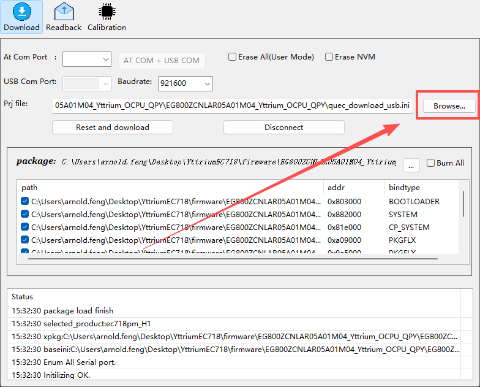
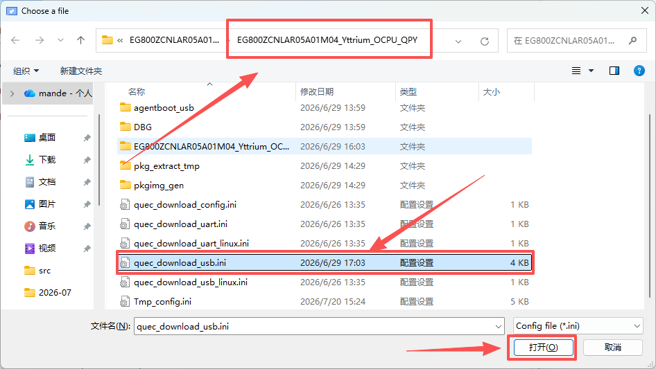
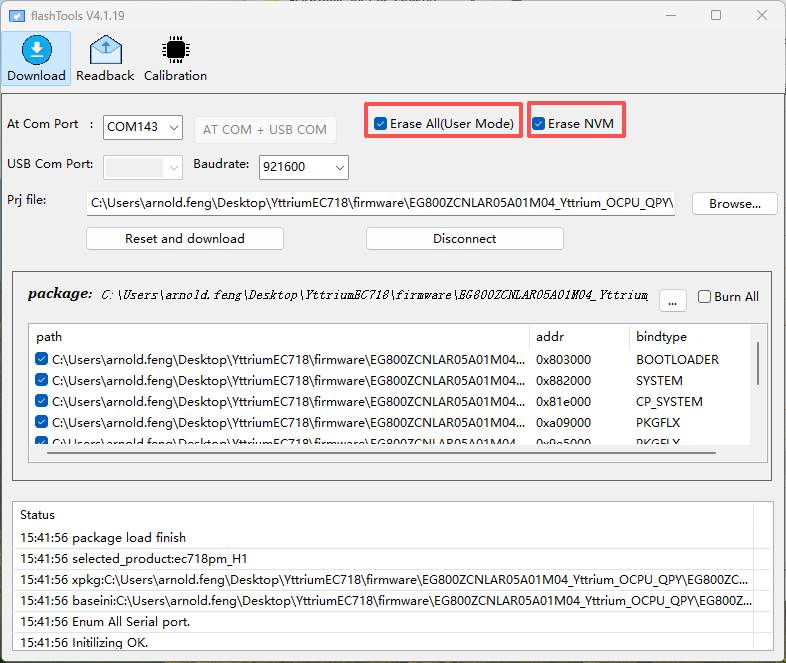
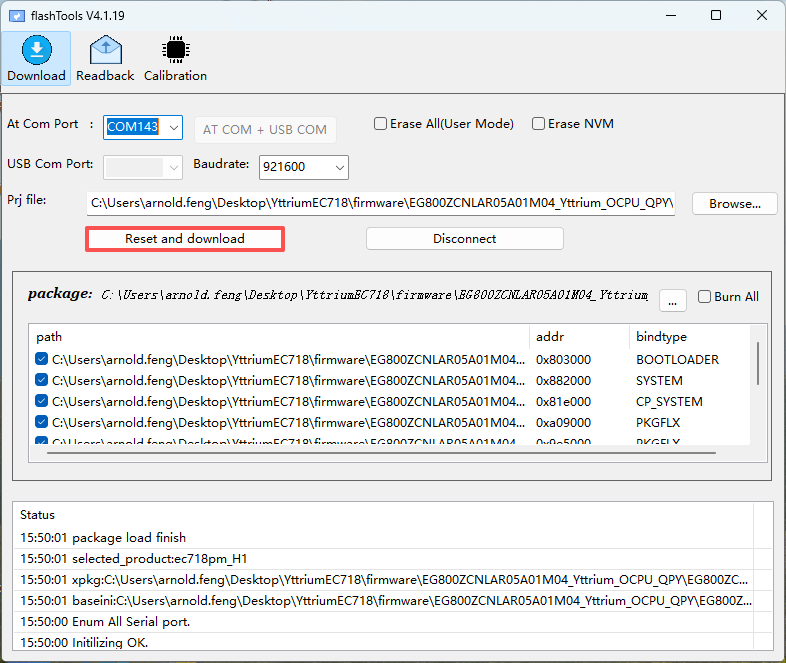
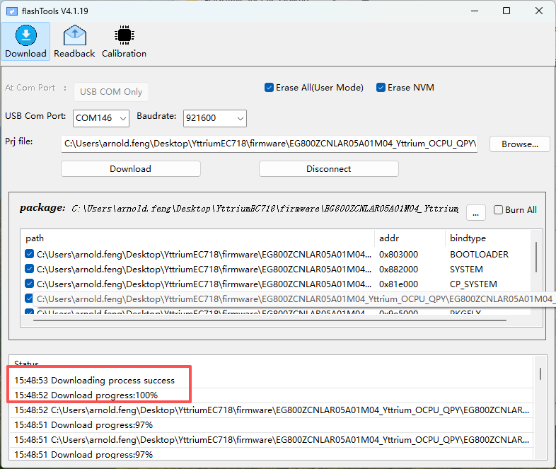

# 固件烧录

本章介绍如何使用 **FlashTools** 将 QuecPython 固件烧录到 Yttrium 开发板（EG800Z 模组）。

## 准备工作

1. **烧录工具**：使用 `tools/` 目录下的 `FlashTools_V4.1.19_2509010.zip`，解压后运行 `FlashTools` 工具
2. **固件文件**：解压 `EG800ZCNLAR05A01M04_Yttrium_OCPU_QPY.7z`，获取固件包（`.pac` 或 `.bin` 格式）
3. **硬件连接**：通过 USB 转串口模块连接开发板的 UART 烧录口

## 烧录步骤

### 1. 解压烧录工具

- 解压 `FlashTools_V4.1.19_2509010.zip`
- 运行 `FlashTools.exe`

### 2. 选择固件

点击 Browse 选择固件：



在 FlashTools 工具中选择解压后的固件文件里的 `quec_download_usb.ini` 文件，点击打开：



### 3. 连接设备

- 将开发板通过 USB 线连接至 PC
- 找到 Quectel USB AT Port，确认其 COM 端口号

### 4. 进入烧录模式

- 选中端口号后，将右侧 Erase All (User Mode) 和 Erase NVM 两个选项打钩
- 波特率选择 921600



### 5. 开始烧录

FlashTools 工具识别到 COM 端口后，点击 **Reset and download** 按钮：



等待进度条走完，提示烧录成功：



### 6. 重启设备

烧录完成后，按 RESET 键或重新上电，设备将以新固件启动。

## 常见问题

| 问题 | 可能原因 | 解决方法 |
|---|---|---|
| FlashTools 无法识别 COM 口 | 驱动未安装 | 安装对应 USB 转串口驱动（CH340 等） |
| 烧录后无法启动 | 固件不匹配 | 确认固件文件与模组型号一致（EG800Z） |
| 串口无响应 | 波特率或串口号错误 | 检查 COM 口配置，默认波特率 921600 |

## 烧录后验证

烧录成功后，使用串口工具（115200 波特率）连接开发板，在 REPL 中执行：

```python
>>> print('hello world')
hello world
```
