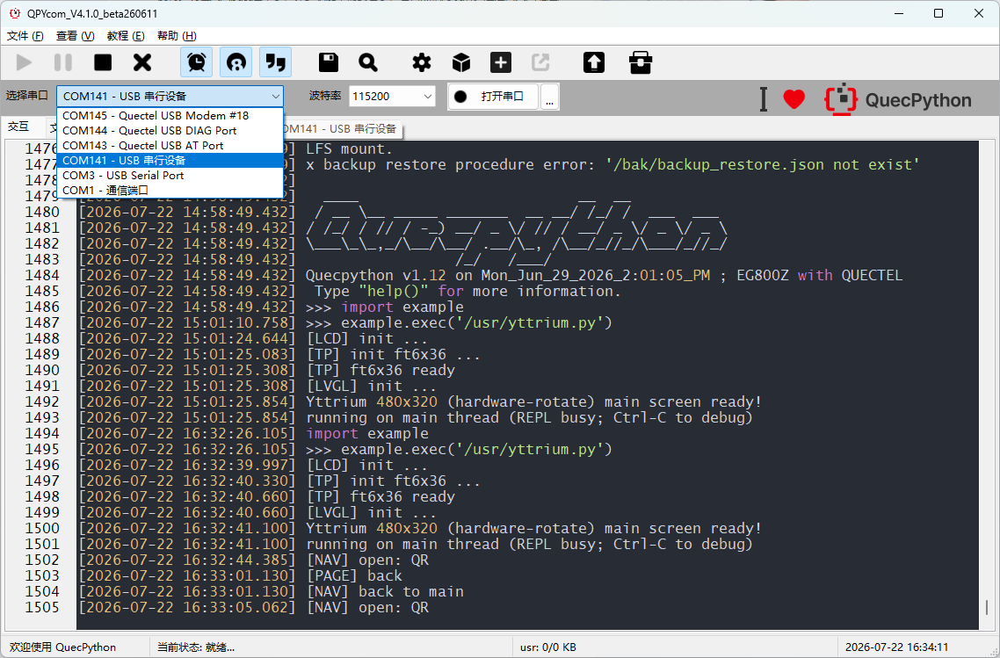
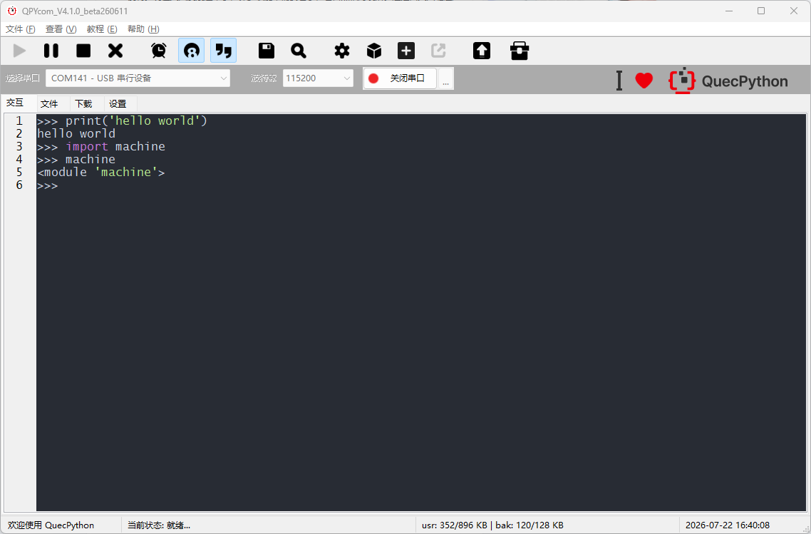
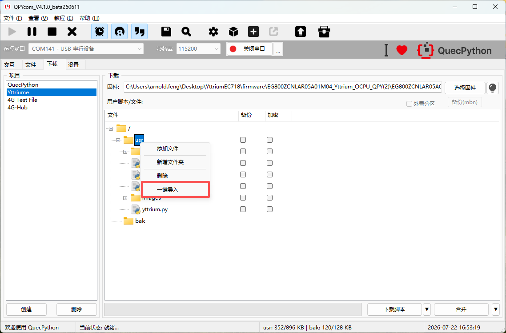
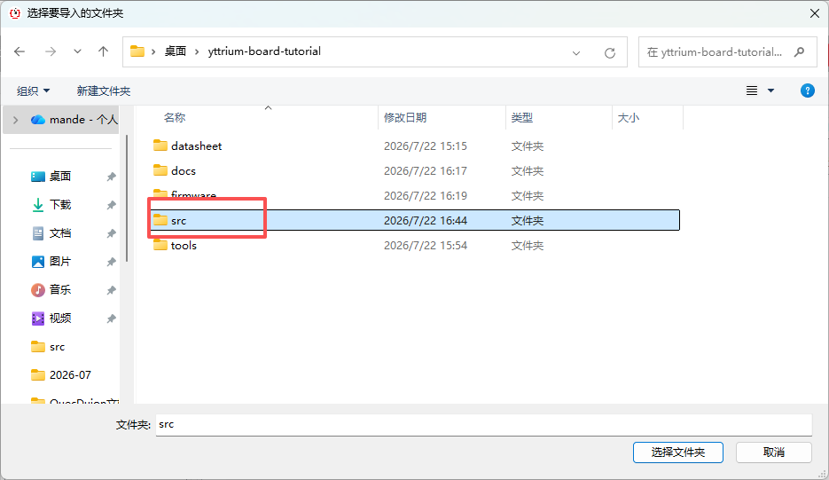
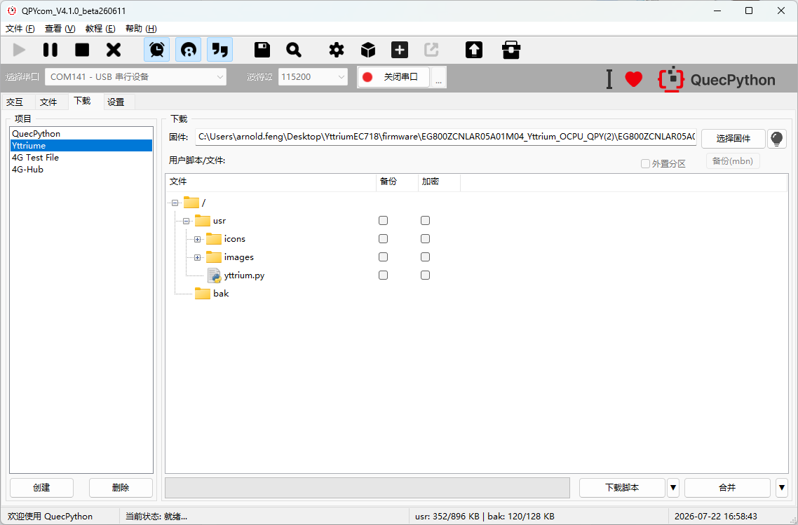
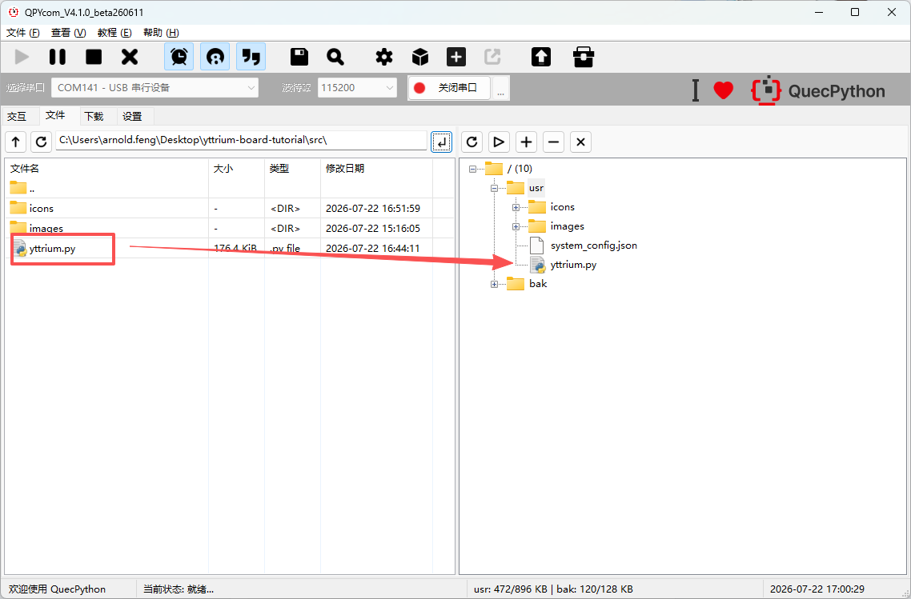
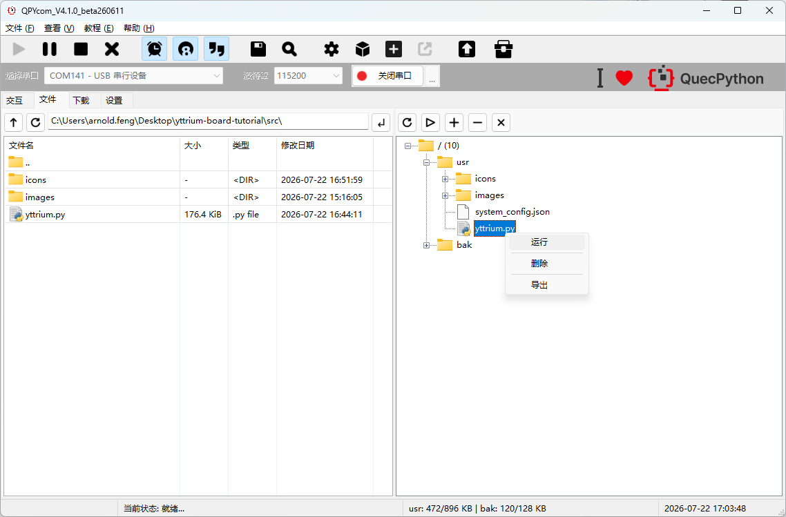

# 运行 Demo

本章介绍如何使用 **QPYCOM** 将 Demo 代码部署到 Yttrium 开发板并启动运行。

## 准备工作

| 项目 | 说明 |
|---|---|
| 开发板 | 已烧录 QuecPython 固件（参考 [02_firmwareFlashing](../02_firmwareFlashing/README.md)） |
| PC 工具 | QPYCOM（QuecPython 串口交互工具） |
| 硬件连接 | 开发板通过 USB 线连接至 PC |
| 代码文件 | `src/yttrium.py` + `icons/` + `images/` |

## QPYCOM 连接设备

### 1. 打开 QPYCOM


### 2. 连接串口

- 选择 **USB 串行设备** 对应的 COM 端口
- 波特率设置为 **115200**
- 点击 **打开串口** 



### 3. 进入 REPL

连接成功后，在终端中按 **Enter** 键，看到 `>>>` 提示符即进入 QuecPython REPL 交互模式。



此时可以交互式执行 Python 语句验证环境：

```python
>>> print('hello world')
hello world
>>> import machine
>>> machine
<module 'machine'>
```

## 烧录代码

### 方式一：一键导入（推荐）
- 右击下载界面的usr目录，选择一键导入



- 选择文件夹src



- 点击三角形选择为下载脚本，点击后等待进度条到达100%，重启模组



### 方式二：拖动烧录（适合修改单个文件时使用）
- 将文件拖入模组的usr目录



#### 文件结构

```
U:/
├── yttrium.py       # 主应用
├── icons/           # 图标资源（48×48 PNG，~50 个）
└── images/          # 商品图片（100×70，8 张）
```

## 启动 Demo
- 直接右键yttrimu.py运行代码



- 或在 QPYCOM 的 REPL 终端中执行：

```python
>>> import example
>>> example.exec('/usr/yttrium.py')
```

开发板 LCD 将显示 **YttriumEC718** 主界面——5×3 图标网格，触摸点击进入各功能页面。

## Demo 功能概览

### 主屏幕（5×3 图标网格）

| 图标 | 功能 | 说明 |
|---|---|---|
| LED | LED 滑块 | PWM 调光（pin25），滑块控制亮度 |
| Clock | 时钟 + 秒表 | 实时时钟 + 计次秒表 |
| ADC | 电压仪表盘 | 三色弧段仪表，ADC0 实时采样 |
| Calc | 计算器 | 四则运算 + 百分比，5×4 按钮 |
| Comm | **通信协议 Hub** | 二级页面，4 个协议入口 |
| Key | 虚拟键盘 | LVGL 内置键盘 + 文本框 |
| Camera | 摄像头预览 | GC0308 取景框 + 快门键（暂不支持） |
| QR | **饮品选购 Demo** | Coffee / Milk Tea 选购 → 付款二维码 |
| Audio | 录音播放 | 波形显示 + Rec/Play/Stop |
| USB | U 盘浏览器 | 文件列表 + 目录切换（暂不支持） |
| Phone | 电话拨号 | 拨号键盘 + CALL/Back |
| Game | **游戏 Hub** | 二级页面，3 个游戏入口 |
| ETH | **以太网 Hub** | 二级页面，3 个功能入口 |
| Buzzer | 蜂鸣器 | 蜂鸣器控制 |
| Weather | 天气 | 天气信息展示 |

### 通信协议 Hub（Comm）

| 协议 | 功能 | 状态 |
|---|---|---|
| UART | 串口终端，TX/RX 收发 + 键盘输入 | 已调通 |
| CAN | CAN 总线监控终端 | 界面就绪 |
| AT | AT 命令交互终端，真实 atcmd 收发 | 界面就绪 |
| RS485 | RS485 Modbus 终端 | 界面就绪 |

### 游戏 Hub（Game）

| 游戏 | 说明 |
|---|---|
| Snake | 贪吃蛇，34×20 网格，触摸滑动操控 |
| 2048 | 经典 2048，4×4 网格，滑动合并 |
| Tetris | 俄罗斯方块 |

### 以太网 Hub（ETH）

| 功能 | 说明 |
|---|---|
| IP | 网络信息（W5500 初始化、ipconfig、DHCP） |
| PING | Ping 诊断工具 |
| TCP | TCP Client 终端 |

### 饮品选购 Demo（QR）

- Coffee / Milk Tea 两个 Tab，各 4 个商品
- 商品卡片：图片 + 名称 + 价格 + 勾选圆
- 选中商品 → Pay → 弹出付款二维码 + 总价
- 商品图片位于 `U:/images/`

## API 依赖

Demo 应用依赖以下 QuecPython 模块：

| 模块 | 用途 |
|---|---|
| `lvgl` | GUI 框架 |
| `machine` | 硬件驱动（LCD、Pin、UART 等） |
| `tp.ft6x36` | 触摸驱动 |
| `misc` | 外设控制（PWM、ADC、Power） |
| `atcmd` | AT 指令收发 |
| `ethernet`（W5500） | 以太网通信 |
| `qrcode` | 二维码生成 |
| `_thread`、`utime` | 多线程 + 定时器 |

## 常见问题

| 问题 | 可能原因 | 解决方法 |
|---|---|---|
| QPYCOM 无法连接 | COM 口被占用或驱动问题 | 关闭其他串口工具（SSCOM 等），确认驱动正常 |
| `>>>` 提示符不出现 | 设备未进入 REPL | 按 Enter 键重试，或按 RESET 复位 |
| `import example` 失败 | 固件不完整 | 重新烧录固件，参考 [02_firmwareFlashing](../02_firmwareFlashing/README.md) |
| LCD 不显示或白屏 | 屏幕未正确初始化 | 复位设备重试，检查 LCD FPC 连接 |
| 触摸无响应 | 触摸驱动未加载 | 确认 ft6x36 驱动已集成在固件中 |
| 文件传输失败 | 设备空间不足 | 清理模组内无用文件后重试 |

> 更多帮助请在 REPL 中执行 `help()` 查看 QuecPython 文档，或使用 [SSCOM](../../tools/sscom5.13.1.zip) 作为备选串口工具。
